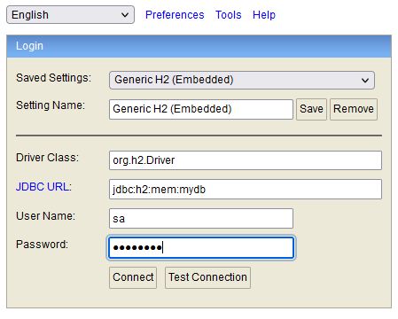
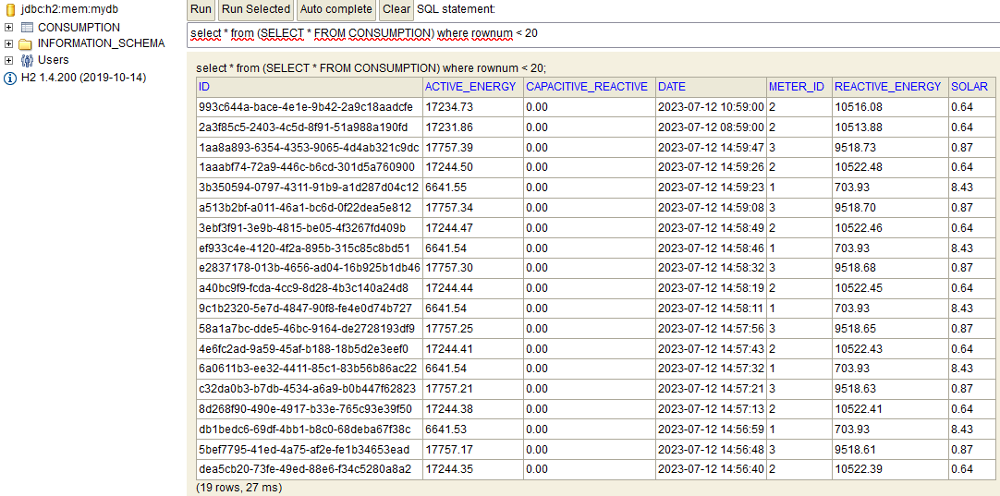
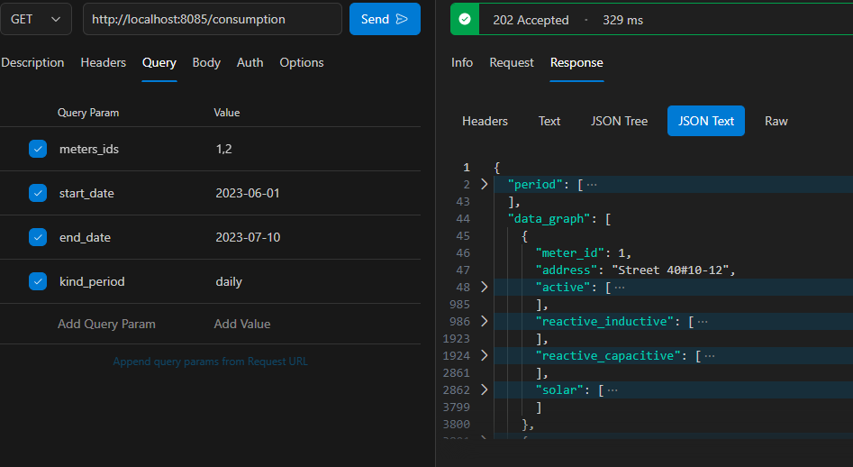
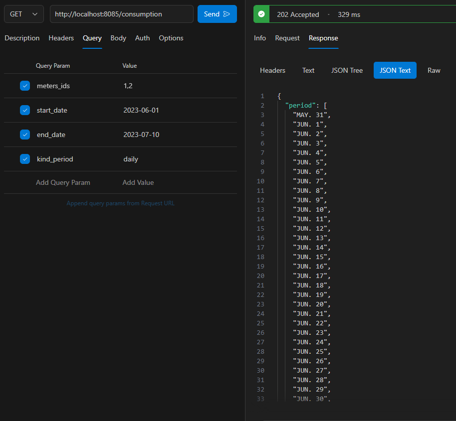
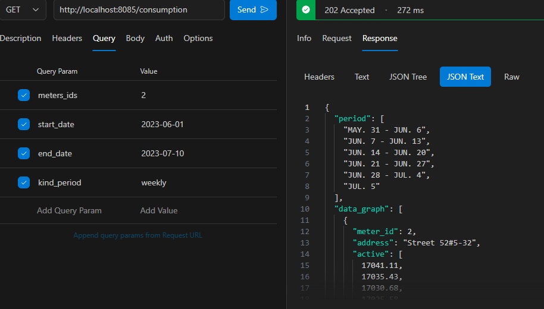
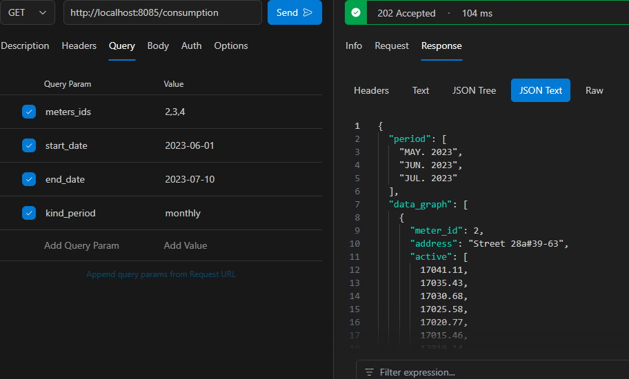

# Consumption Spring Service

### Acerca de
Es un servicio encargado de almacenar los registros de consumo de energía de los medidores de clientes, apoyado de
un archivo csv estratégicamente creado.
El servicio guarda la información en un base de datos H2 en memoria y procesa la información del archivo csv por lotes
para sacar provecho del "multithreading".

El servicio permite realizar consulta a los registros mediante un endpoint proporcionando uno o más medidores, un rango de fechas y un
el periodo (diaria, semanal o mensual) como se visualiza en la sección de 'uso de la aplicación'.

### Construir y ejecutar aplicación
``` 
mvn clean package
```
``` 
java -jar path_jar_file
```

### Datasource
* Ingresamos a http://localhost:8085/h2-console/ y proporcionamos la clave 'password' con el usuario 'sa'.





### Uso del aplicativo
* Listar consumo periodo diario (daily)





* Listar consumo periodo semanal (weekly)



* Listar consumo periodo mensual (monthly)


